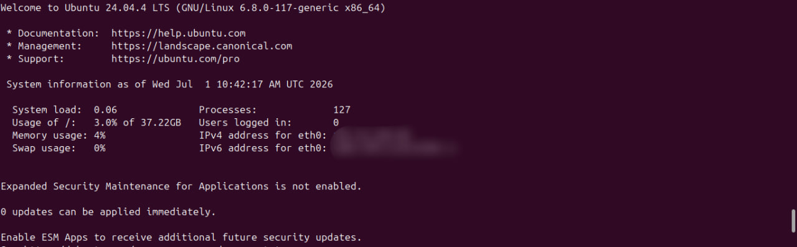
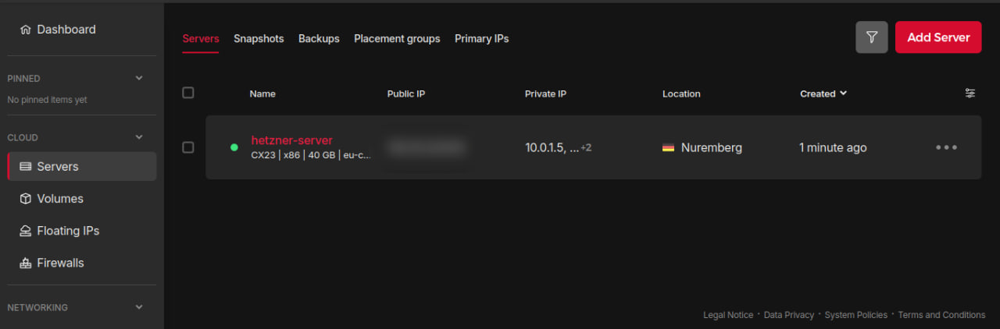
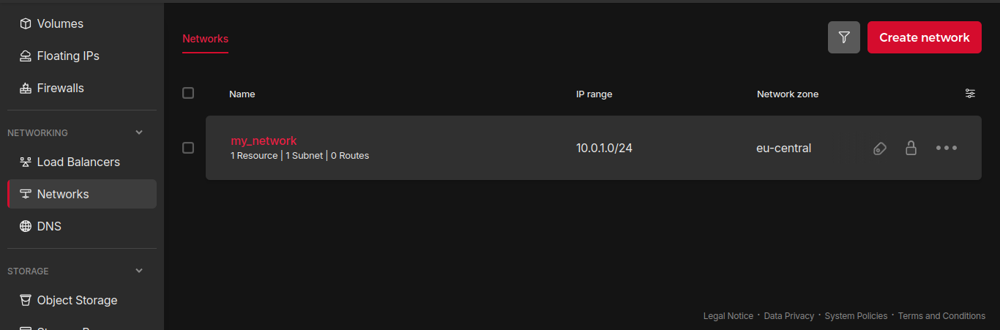
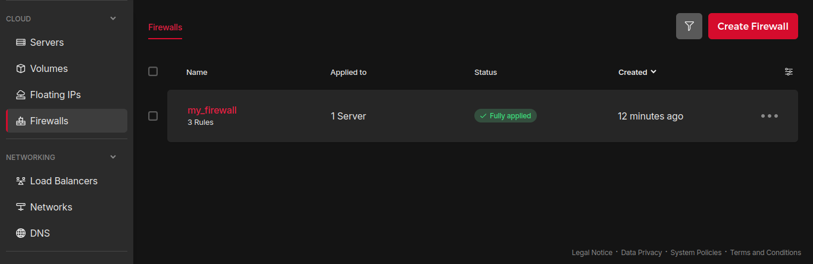

# Hetzner Cloud Infrastructure with Terraform

Infrastructure as Code (IaC) project that provisions a virtual machine on Hetzner Cloud with a private network and firewall, using Terraform.

---

## Overview

This project demonstrates how to define and manage cloud infrastructure declaratively. Instead of manually configuring resources via the Hetzner dashboard, everything is described in `.tf` files and provisioned automatically.

The stack includes:

- **Hetzner Cloud VM** — Ubuntu 24.04, CX22 (2 vCPU, 4GB RAM)
- **Private Network** — isolated internal network for the server
- **Firewall** — rules to allow only SSH and HTTP traffic

---

## Architecture

```
                    ┌──────────────────────────┐
                    │     Hetzner Cloud        │
                    │                          │
                    │  ┌─────────────────────┐ │
                    │  │      Firewall       │ │
                    │  │  - SSH  (port 22)   │ │
                    │  │  - HTTP (port 80)   │ │
                    │  └─────────┬───────────┘ │
                    │            │             │
                    │  ┌─────────▼───────────┐ │
                    │  │    VM (CX22)        │ │
                    │  │  Ubuntu 24.04       │ │
                    │  │                     │ │
                    │  │  ┌────────────────┐ │ │
                    │  │  │ Private Network│ │ │
                    │  │  │ 10.0.0.0/16    │ │ │
                    │  │  └────────────────┘ │ │
                    │  └─────────────────────┘ │
                    └──────────────────────────┘
```

---

## Technologies

| Tool | Version | Purpose |
|------|---------|---------|
| [Terraform](https://www.terraform.io/) | >= 1.0 | Infrastructure as Code |
| [Hetzner Cloud Provider](https://registry.terraform.io/providers/hetznercloud/hcloud/latest/docs) | ~> 1.45 | Terraform provider for Hetzner |
| [Hetzner Cloud](https://www.hetzner.com/cloud) | — | Cloud infrastructure provider |

---

## Getting Started

### Prerequisites

- ssh-keygen, cat and nano installed 
- [Terraform](https://developer.hashicorp.com/terraform/install) >= 1.0 installed
- Access to an Hetzner Cloud account with an API token

### Generate a local SSH Key (if you dont already have one)

```bash
ssh-keygen -t rsa -C "some comment here"
```

### Generate a Hetzner API Token and set the ssh key (if you haven't already)

1. Log in to [console.hetzner.cloud](https://console.hetzner.cloud)
2. Select your project → **Security** 
3. → **SSH Keys** Add your ssh key with **Add SSH key** and name it
4. → **API Tokens** Create a new token with **Read & Write** permissions

### Installation

1. Clone the repository:
```bash
git clone https://github.com/Alelucci/terraform-hetzner-deploy.git
cd terraform-hetzner-deploy
```

2. Create your variables file:
```bash
cp terraform.tfvars.example terraform.tfvars
```

3. Edit `terraform.tfvars` with your token, ssh key name and others:
```hcl
hcloud_token = "your-hetzner-api-token"
sshkey_name = "my_ssh_key"
```

4. Initialize Terraform (downloads the Hetzner provider):
```bash
terraform init
```

5. Preview what will be created:
```bash
terraform plan
```
[View successfull plan output example](docs/plan_output.txt)

6. Apply the configuration:
```bash
terraform apply
```
[View successfull apply output example](docs/apply_output.txt)

7. Once done, retrieve the server IP from the output:
```bash
terraform output server_ip
```

8. You can now connect via ssh to your new server using the retrieved server IP address:
```bash
ssh -i <~/your/ssh/key/directory> root@<server_ip>
```


### Hetzner Dashboard



---

## Project Structure

```
terraform-hetzner-deploy/
├── .gitignore
├── main.tf                # provider + server, network, firewall resources
├── outputs.tf             # output values (server IP, ID)
├── README.md
├── terraform.tfvars       # your variable values (gitignored)
├── terraform.tfvars.example  # safe template to commit
└── variables.tf           # input variable declarations
```

---

## Configuration

Default values are defined in `variables.tf` and can be overridden in `terraform.tfvars`:

| Variable | Default | Description |
|----------|---------|-------------|
| `hcloud_token` | `/` | Hetzner Cloud API token |
| `server_name` | `hetzner-server` | Name of the VM |
| `server_type` | `cx23` | Machine type (2 vCPU, 4GB RAM) |
| `location` | `nbg1` | Datacenter location (Nuremberg) |
| `image` | `ubuntu-24.04` | Operating system image |
| `net_name` | `my_network` | Name of the network |
| `subnet_zone` | `eu-central` | Subnet location |
| `fw_name` | `my_firewall` | Name of the firewall |
| `fw_allowed_in_tcp_ports` | `"22", "80"` | List of allowed inbound TCP ports |
| `sshkey_name` | `/` | Name of the ssh key used on your Hetzner project |

---

## Cost

The CX22 instance costs approximately **€4-5/month**, billed hourly. To minimize costs during testing:

```bash
terraform apply    # provision infrastructure (billing starts)
# ... test and verify ...
terraform destroy  # destroy everything (billing stops)
```

A typical test session of a few hours costs less than **€0.10**.

---

## Teardown

To destroy all provisioned resources:

```bash
terraform destroy
```

Terraform will list everything it will delete and ask for confirmation before proceeding.
[View successfull destroy output example](docs/destroy_output.txt)

---

## What I learned

- Declaring cloud infrastructure declaratively with HCL (HashiCorp Configuration Language)
- Managing provider authentication securely with sensitive variables
- Configuring private networking and firewall rules as code
- Understanding Terraform state and the plan/apply/destroy workflow
- Separating configuration from secrets using `.tfvars` files
- SSH key-based authentication
- Managed SSH key duplicate problem using data source
---

## Possible improvements

- Use remote state storage (Terraform Cloud or S3) for team collaboration
- Extend with additional resources: floating IP, volume, load balancer

---

## License

MIT License
